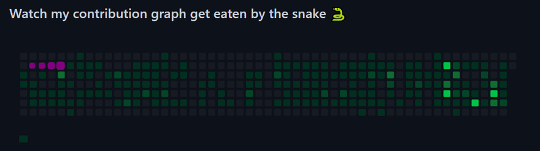

<!-- ██████████████████████████████████████████████████████ -->
<!--           BHANU ASATI  ·  GITHUB PROFILE             -->
<!-- ██████████████████████████████████████████████████████ -->

<div align="center">
  
</div>

<div align="center">

<!-- Terminal boot sequence -->


<!-- Name — big, green, typewriter -->


<!-- Blinking cursor role cycling -->


<br/>

<!-- Green terminal-style badges -->

&nbsp;

&nbsp;


</div>

<br/>

---

<!-- ░░ SECTION 01 — ABOUT ░░ -->


```
╔══════════════════════════════════════════╗
║  $ whoami                                ║
╠══════════════════════════════════════════╣
║                                          ║
║  NAME   ›  Bhanu Asati                   ║
║  FROM   ›  India  🇮🇳                    ║
║  ROLE   ›  Full-Stack Dev + Cloud Eng    ║
║  STATUS ›  [ BUILDING ]  always online   ║
║  DEBUG  ›  console.log("why tho??")      ║
║  OS     ›  Works-On-My-Machine™ v2.0     ║
║  UPTIME ›  24 / 7 / 365                  ║
║                                          ║
╚══════════════════════════════════════════╝
```

**`// Currently executing:`**
```bash
$ ./build --stack react,nextjs,nodejs
$ ./deploy --target aws,azure,gcp
$ ./research --topic "LLMs + Agentic AI"
$ ./contribute --to open-source
```

**`// Accepting connections from:`**
`collabs` &nbsp;·&nbsp; `open-source` &nbsp;·&nbsp; `internships` &nbsp;·&nbsp; `cool ideas`

<br clear="both"/>

<br/>

---

<!-- ░░ SECTION 02 — TECH STACK ░░ -->

<div align="center">

```
╔═══════════════════════════════════════╗
║  $ cat /etc/tech-stack.conf           ║
╚═══════════════════════════════════════╝
```

**— LANGUAGES —**


**— FRONTEND —**


**— BACKEND & APIs —**


**— CLOUD · DEVOPS · INFRA —**


**— DATABASES —**


**— AI / ML —**


**— DESIGN & TOOLS —**


</div>

<br/>

---

<!-- ░░ SECTION 03 — GITHUB STATS ░░ -->

<div align="center">

```
╔═══════════════════════════════════════╗
║  $ github --stats --user BHANUASATI   ║
╚═══════════════════════════════════════╝
```


<br/><br/>


</div>

<br/>

---

<!-- ░░ SECTION 04 — CONTRIBUTION HEATMAP ░░ -->

<div align="center">

```
╔═══════════════════════════════════════╗
║  $ git log --all --graph --oneline    ║
╚═══════════════════════════════════════╝
```


<br/>


</div>

<br/>

---

<!-- ░░ SECTION 05 — PROFILE OVERVIEW ░░ -->

<div align="center">

```
╔═══════════════════════════════════════╗
║  $ gh api /users/BHANUASATI           ║
╚═══════════════════════════════════════╝
```


<br/><br/>


<br/><br/>


<br/><br/>


</div>

<br/>

---

<!-- ░░ SECTION 06 — 3D CONTRIBUTION ░░ -->

<div align="center">

```
╔══════════════════════════════════════════╗
║  $ render --3d --theme night-rainbow     ║
╚══════════════════════════════════════════╝
```


</div>

<br/>

---

<!-- ░░ SECTION 07 — SNAKE ░░ -->

<div align="center">

```
╔═══════════════════════════════════════╗
║  $ ./snake --consume-contributions    ║
╚═══════════════════════════════════════╝
```



</div>

<br/>

---

<!-- ░░ SECTION 08 — DEV QUOTE ░░ -->

<div align="center">

```
╔═══════════════════════════════════════╗
║  $ fortune | cowsay -f tux            ║
╚═══════════════════════════════════════╝
```


</div>

<br/>

---

<!-- ░░ SECTION 09 — CONNECT ░░ -->

<div align="center">

```
╔═══════════════════════════════════════╗
║  $ ping --social                      ║
╚═══════════════════════════════════════╝
```

<a href="https://www.linkedin.com/in/bhanu-asati-155493253">
  
</a>
&nbsp;
<a href="https://www.instagram.com/asati_raja_/">
  
</a>
&nbsp;
<a href="https://www.youtube.com/@CodeXGamerVlogs">
  
</a>
&nbsp;
<a href="https://www.facebook.com/bhanu.asati.7/">
  
</a>

</div>

<br/>

---

<!-- ░░ SECTION 10 — SUPPORT ░░ -->

<div align="center">

```
╔═══════════════════════════════════════╗
║  $ sudo apt-get install caffeine      ║
╚═══════════════════════════════════════╝
```

<sub><i>if my code saved you a Stack Overflow visit — fuel the next commit ☕</i></sub>

<br/><br/>

<a href="https://buymeacoffee.com/BhanuAsati">
  
</a>
&nbsp;
<a href="https://ko-fi.com/BhanuAsati">
  
</a>
&nbsp;
<a href="https://paypal.me/BhanuAsati">
  
</a>

</div>

<br/>

---

<!-- ░░ FOOTER ░░ -->

<div align="center">


<br/>


</div>
